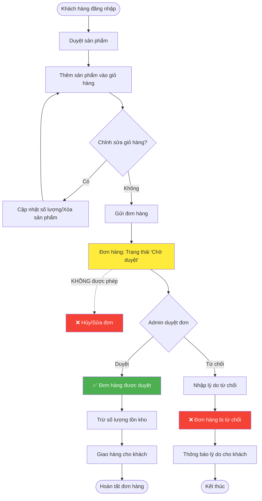
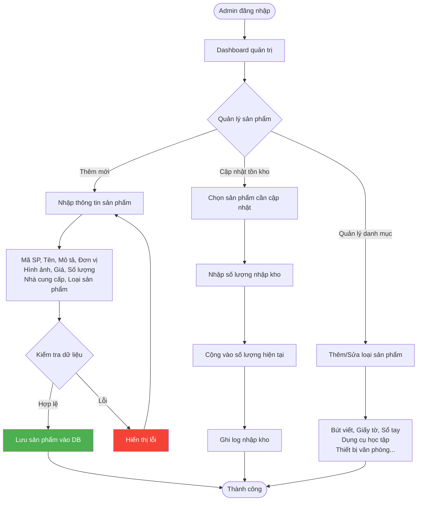
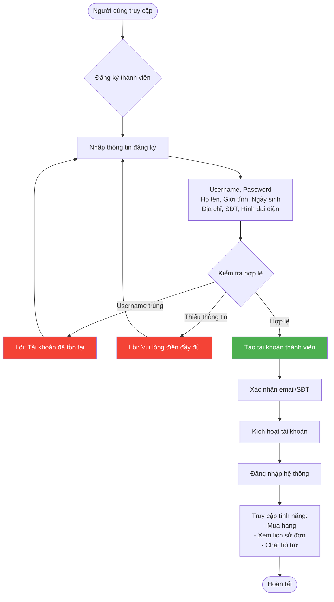
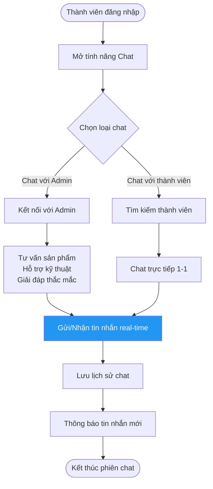
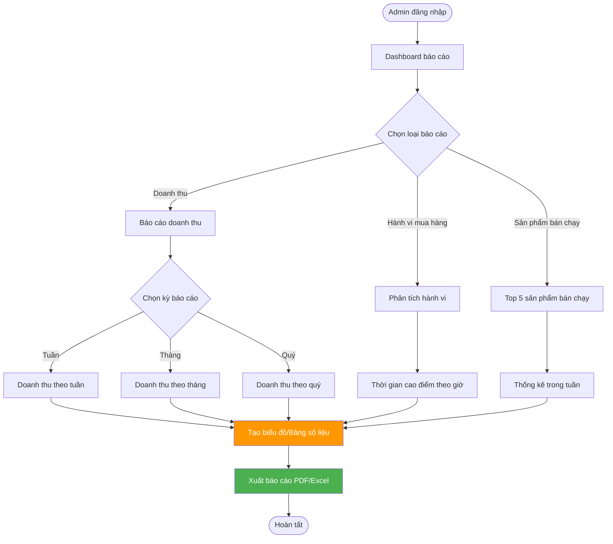
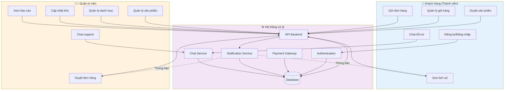
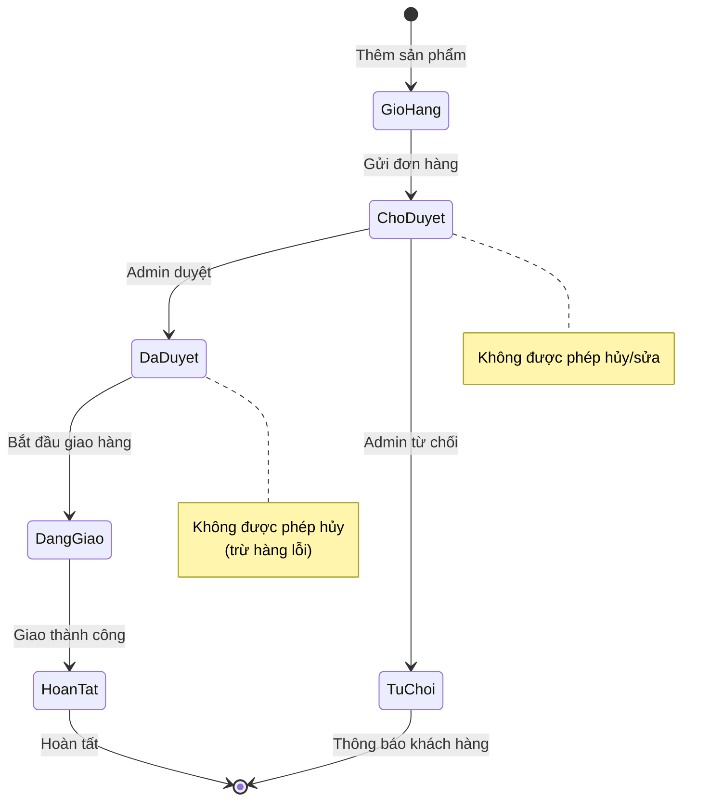

# Workflow - Hệ thống Bán Văn phòng phẩm Online

## 1. Workflow Quy trình Đặt hàng (Order Flow)

### Quy tắc quan trọng:
- ⚠️ **Sau khi gửi đơn:** Khách hàng KHÔNG được hủy/sửa để tránh xung đột dữ liệu
- ⚠️ **Sau khi duyệt:** Khách hàng KHÔNG được hủy/trả hàng (trừ trường hợp hàng lỗi)
- ⚠️ **Từ chối đơn:** Admin BẮT BUỘC nhập lý do cụ thể

---

## 2. Workflow Quản lý Sản phẩm & Kho

---

## 3. Workflow Quản lý Thành viên

---

## 4. Workflow Hệ thống Chat

---

## 5. Workflow Thống kê & Báo cáo (Admin)

---

## 6. Workflow Tổng quan Hệ thống

---

## 7. Ma trận Phân quyền

| Tính năng | Khách hàng | Thành viên | Admin |
|-----------|:----------:|:----------:|:-----:|
| Xem sản phẩm | ✅ | ✅ | ✅ |
| Thêm giỏ hàng | ❌ | ✅ | ✅ |
| Đặt hàng | ❌ | ✅ | ✅ |
| Hủy đơn (Chờ duyệt) | ❌ | ❌ | ✅ |
| Hủy đơn (Đã duyệt) | ❌ | ❌ | ❌ |
| Duyệt đơn | ❌ | ❌ | ✅ |
| Thêm/Sửa sản phẩm | ❌ | ❌ | ✅ |
| Cập nhật kho | ❌ | ❌ | ✅ |
| Xem báo cáo | ❌ | ❌ | ✅ |
| Chat | ❌ | ✅ | ✅ |
| Đăng ký thành viên | ✅ | - | - |

---

## 8. Trạng thái Đơn hàng

---

## 9. Use Cases chính

### UC-01: Đặt hàng
**Actor:** Thành viên  
**Mô tả:** Thành viên chọn sản phẩm, thêm vào giỏ hàng và gửi đơn hàng

### UC-02: Duyệt đơn hàng
**Actor:** Admin  
**Mô tả:** Admin xem xét và duyệt/từ chối đơn hàng của khách

### UC-03: Quản lý sản phẩm
**Actor:** Admin  
**Mô tả:** Admin thêm mới sản phẩm và cập nhật thông tin kho

### UC-04: Chat hỗ trợ
**Actor:** Thành viên, Admin  
**Mô tả:** Trao đổi trực tuyến giữa thành viên hoặc với Admin

### UC-05: Xem báo cáo doanh thu
**Actor:** Admin  
**Mô tả:** Theo dõi doanh thu theo tuần/tháng/quý và sản phẩm bán chạy

---

## 📌 Lưu ý triển khai

### Bảo mật
- Mã hóa mật khẩu thành viên (bcrypt/SHA256)
- JWT/Session cho authentication
- HTTPS cho mọi giao tiếp

### Hiệu năng
- Cache danh sách sản phẩm hot
- Index database cho tìm kiếm nhanh
- Lazy loading hình ảnh sản phẩm

### Quy tắc nghiệp vụ
- ✅ Kiểm tra tồn kho trước khi cho phép đặt hàng
- ✅ Lock đơn hàng ngay sau khi gửi (trạng thái "Chờ duyệt")
- ✅ Transaction khi trừ kho để đảm bảo nhất quán dữ liệu
- ✅ Bắt buộc lý do khi Admin từ chối đơn

---

**Phiên bản:** 1.0  
**Cập nhật:** 16/12/2025  
**Nhóm phát triển:** VPP_OSS_T10
