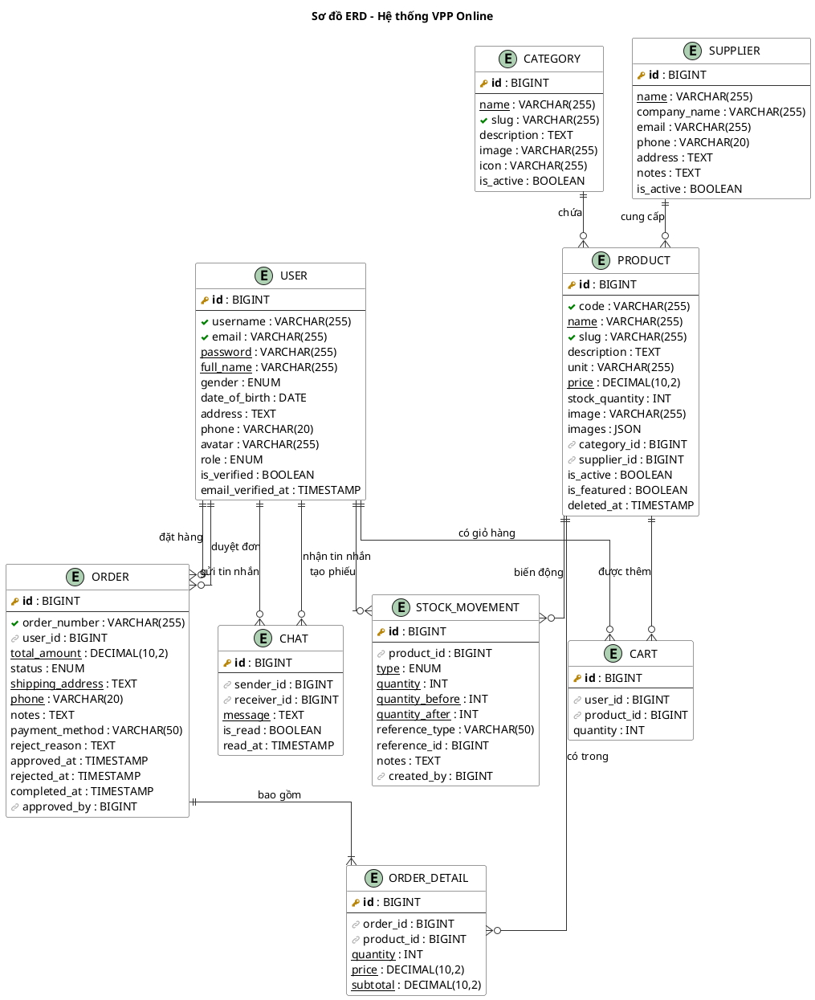
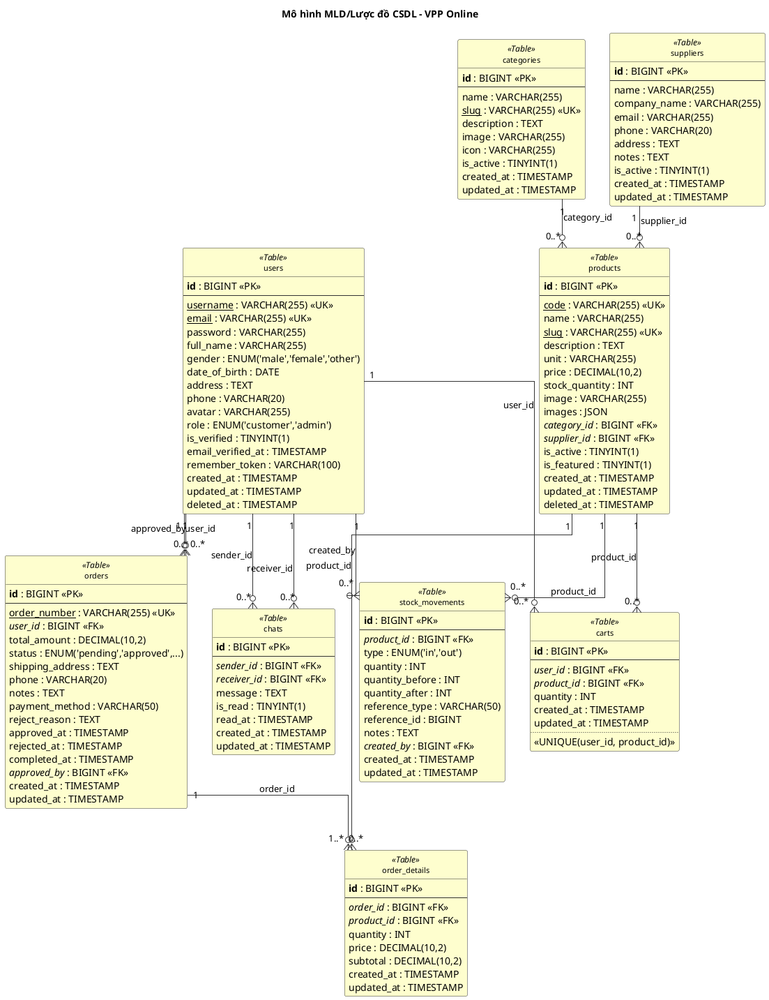
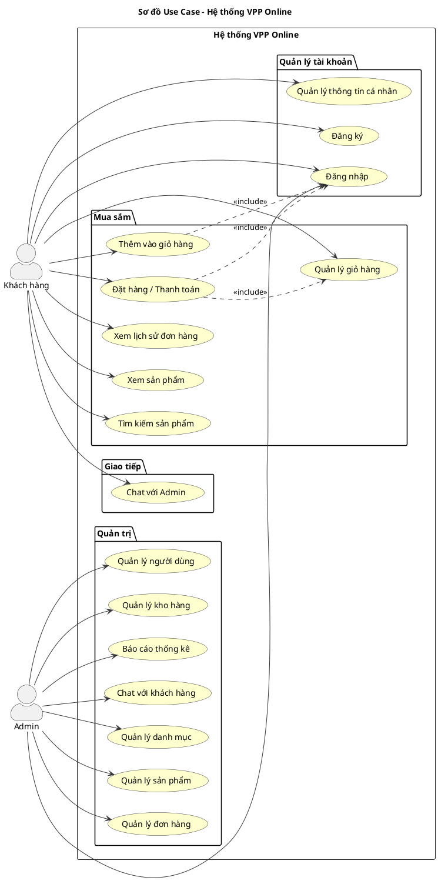

# SƠ ĐỒ CƠ SỞ DỮ LIỆU - VPP ONLINE

## Hệ thống Văn Phòng Phẩm Online
**Phiên bản:** 1.0  
**Ngày cập nhật:** 05/01/2026

---

## 1. MÔ HÌNH ERD/MCD (Mô hình dữ liệu mức quan niệm)

### 1.1. Sơ đồ thực thể - mối quan hệ (Entity Relationship Diagram)



### 1.2. Mô tả thực thể và mối quan hệ

| STT | Thực thể | Mô tả | Quan hệ chính |
|-----|----------|-------|---------------|
| 1 | **USER** | Người dùng hệ thống (Admin/Customer) | Đặt hàng, chat, quản lý kho |
| 2 | **CATEGORY** | Danh mục sản phẩm | Chứa nhiều sản phẩm |
| 3 | **SUPPLIER** | Nhà cung cấp | Cung cấp nhiều sản phẩm |
| 4 | **PRODUCT** | Sản phẩm văn phòng phẩm | Thuộc danh mục, nhà cung cấp |
| 5 | **ORDER** | Đơn đặt hàng | Thuộc người dùng, có nhiều chi tiết |
| 6 | **ORDER_DETAIL** | Chi tiết đơn hàng | Liên kết đơn hàng - sản phẩm |
| 7 | **CART** | Giỏ hàng | Liên kết người dùng - sản phẩm |
| 8 | **CHAT** | Tin nhắn trò chuyện | Giữa 2 người dùng |
| 9 | **STOCK_MOVEMENT** | Lịch sử xuất/nhập kho | Theo dõi biến động sản phẩm |

### 1.3. Bảng ký hiệu quan hệ

| Ký hiệu | Ý nghĩa | Ví dụ |
|---------|---------|-------|
| `\|\|--o{` | Một - Nhiều (1:N) | USER có nhiều ORDER |
| `\|\|--\|{` | Một - Nhiều (bắt buộc) | ORDER phải có ORDER_DETAIL |
| `o{--o{` | Nhiều - Nhiều (M:N) | Qua bảng trung gian |

---

## 2. MÔ HÌNH MLD/LƯỢC ĐỒ CSDL (Mô hình dữ liệu mức logic/vật lý)

### 2.1. Sơ đồ lược đồ quan hệ (Relational Schema)



### 2.2. Lược đồ quan hệ dạng văn bản

```
users (id, username, email, password, full_name, gender, date_of_birth, 
       address, phone, avatar, role, is_verified, email_verified_at, 
       remember_token, created_at, updated_at, deleted_at)
       
categories (id, name, slug, description, image, icon, is_active, 
            created_at, updated_at)
            
suppliers (id, name, company_name, email, phone, address, notes, 
           is_active, created_at, updated_at)
           
products (id, code, name, slug, description, unit, price, stock_quantity, 
          image, images, #category_id, #supplier_id, is_active, is_featured, 
          created_at, updated_at, deleted_at)
          
orders (id, order_number, #user_id, total_amount, status, shipping_address, 
        phone, notes, payment_method, reject_reason, approved_at, rejected_at, 
        completed_at, #approved_by, created_at, updated_at)
        
order_details (id, #order_id, #product_id, quantity, price, subtotal, 
               created_at, updated_at)
               
carts (id, #user_id, #product_id, quantity, created_at, updated_at)

chats (id, #sender_id, #receiver_id, message, is_read, read_at, 
       created_at, updated_at)
       
stock_movements (id, #product_id, type, quantity, quantity_before, 
                 quantity_after, reference_type, reference_id, notes, 
                 #created_by, created_at, updated_at)
```

**Chú thích:** `#` = Khóa ngoại (Foreign Key)

### 2.3. Chi tiết các bảng

#### 2.3.1. Bảng `users` (Người dùng)

| Cột | Kiểu dữ liệu | Ràng buộc | Mô tả |
|-----|--------------|-----------|-------|
| id | BIGINT UNSIGNED | PRIMARY KEY, AUTO_INCREMENT | Mã người dùng |
| username | VARCHAR(255) | UNIQUE, NOT NULL | Tên đăng nhập |
| email | VARCHAR(255) | UNIQUE, NOT NULL | Email |
| password | VARCHAR(255) | NOT NULL | Mật khẩu (hashed) |
| full_name | VARCHAR(255) | NOT NULL | Họ và tên |
| gender | ENUM('male','female','other') | NULL | Giới tính |
| date_of_birth | DATE | NULL | Ngày sinh |
| address | TEXT | NULL | Địa chỉ |
| phone | VARCHAR(20) | NULL | Số điện thoại |
| avatar | VARCHAR(255) | NULL | Ảnh đại diện |
| role | ENUM('customer','admin') | DEFAULT 'customer' | Vai trò |
| is_verified | TINYINT(1) | DEFAULT 0 | Đã xác thực |
| email_verified_at | TIMESTAMP | NULL | Thời gian xác thực email |
| remember_token | VARCHAR(100) | NULL | Token ghi nhớ |
| created_at | TIMESTAMP | NULL | Ngày tạo |
| updated_at | TIMESTAMP | NULL | Ngày cập nhật |
| deleted_at | TIMESTAMP | NULL | Ngày xóa (soft delete) |

#### 2.3.2. Bảng `categories` (Danh mục)

| Cột | Kiểu dữ liệu | Ràng buộc | Mô tả |
|-----|--------------|-----------|-------|
| id | BIGINT UNSIGNED | PRIMARY KEY, AUTO_INCREMENT | Mã danh mục |
| name | VARCHAR(255) | NOT NULL | Tên danh mục |
| slug | VARCHAR(255) | UNIQUE, NOT NULL | Đường dẫn thân thiện |
| description | TEXT | NULL | Mô tả |
| image | VARCHAR(255) | NULL | Ảnh danh mục |
| icon | VARCHAR(255) | NULL | Icon |
| is_active | TINYINT(1) | DEFAULT 1 | Trạng thái hoạt động |
| created_at | TIMESTAMP | NULL | Ngày tạo |
| updated_at | TIMESTAMP | NULL | Ngày cập nhật |

#### 2.3.3. Bảng `suppliers` (Nhà cung cấp)

| Cột | Kiểu dữ liệu | Ràng buộc | Mô tả |
|-----|--------------|-----------|-------|
| id | BIGINT UNSIGNED | PRIMARY KEY, AUTO_INCREMENT | Mã NCC |
| name | VARCHAR(255) | NOT NULL | Tên NCC |
| company_name | VARCHAR(255) | NULL | Tên công ty |
| email | VARCHAR(255) | NULL | Email |
| phone | VARCHAR(20) | NULL | Số điện thoại |
| address | TEXT | NULL | Địa chỉ |
| notes | TEXT | NULL | Ghi chú |
| is_active | TINYINT(1) | DEFAULT 1 | Trạng thái |
| created_at | TIMESTAMP | NULL | Ngày tạo |
| updated_at | TIMESTAMP | NULL | Ngày cập nhật |

#### 2.3.4. Bảng `products` (Sản phẩm)

| Cột | Kiểu dữ liệu | Ràng buộc | Mô tả |
|-----|--------------|-----------|-------|
| id | BIGINT UNSIGNED | PRIMARY KEY, AUTO_INCREMENT | Mã SP |
| code | VARCHAR(255) | UNIQUE, NOT NULL | Mã sản phẩm |
| name | VARCHAR(255) | NOT NULL | Tên sản phẩm |
| slug | VARCHAR(255) | UNIQUE, NOT NULL | Đường dẫn |
| description | TEXT | NULL | Mô tả |
| unit | VARCHAR(255) | DEFAULT 'Cái' | Đơn vị tính |
| price | DECIMAL(10,2) | NOT NULL | Giá bán |
| stock_quantity | INT | DEFAULT 0 | Số lượng tồn |
| image | VARCHAR(255) | NULL | Ảnh chính |
| images | JSON | NULL | Nhiều ảnh |
| category_id | BIGINT UNSIGNED | FK → categories.id | Mã danh mục |
| supplier_id | BIGINT UNSIGNED | FK → suppliers.id | Mã NCC |
| is_active | TINYINT(1) | DEFAULT 1 | Đang bán |
| is_featured | TINYINT(1) | DEFAULT 0 | Nổi bật |
| created_at | TIMESTAMP | NULL | Ngày tạo |
| updated_at | TIMESTAMP | NULL | Ngày cập nhật |
| deleted_at | TIMESTAMP | NULL | Ngày xóa |

#### 2.3.5. Bảng `orders` (Đơn hàng)

| Cột | Kiểu dữ liệu | Ràng buộc | Mô tả |
|-----|--------------|-----------|-------|
| id | BIGINT UNSIGNED | PRIMARY KEY | Mã đơn hàng |
| order_number | VARCHAR(255) | UNIQUE, NOT NULL | Số đơn hàng |
| user_id | BIGINT UNSIGNED | FK → users.id | Mã khách hàng |
| total_amount | DECIMAL(10,2) | NOT NULL | Tổng tiền |
| status | ENUM(...) | DEFAULT 'pending' | Trạng thái |
| shipping_address | TEXT | NOT NULL | Địa chỉ giao |
| phone | VARCHAR(20) | NOT NULL | SĐT |
| notes | TEXT | NULL | Ghi chú |
| payment_method | VARCHAR(50) | NULL | Phương thức TT |
| reject_reason | TEXT | NULL | Lý do từ chối |
| approved_at | TIMESTAMP | NULL | Ngày duyệt |
| rejected_at | TIMESTAMP | NULL | Ngày từ chối |
| completed_at | TIMESTAMP | NULL | Ngày hoàn thành |
| approved_by | BIGINT UNSIGNED | FK → users.id | Người duyệt |
| created_at | TIMESTAMP | NULL | Ngày tạo |
| updated_at | TIMESTAMP | NULL | Ngày cập nhật |

**Giá trị ENUM status:** `pending`, `approved`, `rejected`, `shipping`, `completed`, `cancelled`

#### 2.3.6. Bảng `order_details` (Chi tiết đơn hàng)

| Cột | Kiểu dữ liệu | Ràng buộc | Mô tả |
|-----|--------------|-----------|-------|
| id | BIGINT UNSIGNED | PRIMARY KEY | Mã chi tiết |
| order_id | BIGINT UNSIGNED | FK → orders.id | Mã đơn hàng |
| product_id | BIGINT UNSIGNED | FK → products.id | Mã sản phẩm |
| quantity | INT | NOT NULL | Số lượng |
| price | DECIMAL(10,2) | NOT NULL | Đơn giá |
| subtotal | DECIMAL(10,2) | NOT NULL | Thành tiền |
| created_at | TIMESTAMP | NULL | Ngày tạo |
| updated_at | TIMESTAMP | NULL | Ngày cập nhật |

#### 2.3.7. Bảng `carts` (Giỏ hàng)

| Cột | Kiểu dữ liệu | Ràng buộc | Mô tả |
|-----|--------------|-----------|-------|
| id | BIGINT UNSIGNED | PRIMARY KEY | Mã giỏ |
| user_id | BIGINT UNSIGNED | FK → users.id | Mã người dùng |
| product_id | BIGINT UNSIGNED | FK → products.id | Mã sản phẩm |
| quantity | INT | DEFAULT 1 | Số lượng |
| created_at | TIMESTAMP | NULL | Ngày thêm |
| updated_at | TIMESTAMP | NULL | Ngày cập nhật |

**Ràng buộc:** UNIQUE(user_id, product_id)

#### 2.3.8. Bảng `chats` (Tin nhắn)

| Cột | Kiểu dữ liệu | Ràng buộc | Mô tả |
|-----|--------------|-----------|-------|
| id | BIGINT UNSIGNED | PRIMARY KEY | Mã tin nhắn |
| sender_id | BIGINT UNSIGNED | FK → users.id | Người gửi |
| receiver_id | BIGINT UNSIGNED | FK → users.id | Người nhận |
| message | TEXT | NOT NULL | Nội dung |
| is_read | TINYINT(1) | DEFAULT 0 | Đã đọc |
| read_at | TIMESTAMP | NULL | Thời gian đọc |
| created_at | TIMESTAMP | NULL | Ngày gửi |
| updated_at | TIMESTAMP | NULL | Ngày cập nhật |

#### 2.3.9. Bảng `stock_movements` (Biến động kho)

| Cột | Kiểu dữ liệu | Ràng buộc | Mô tả |
|-----|--------------|-----------|-------|
| id | BIGINT UNSIGNED | PRIMARY KEY | Mã biến động |
| product_id | BIGINT UNSIGNED | FK → products.id | Mã sản phẩm |
| type | ENUM('in','out') | NOT NULL | Loại (nhập/xuất) |
| quantity | INT | NOT NULL | Số lượng |
| quantity_before | INT | NOT NULL | SL trước |
| quantity_after | INT | NOT NULL | SL sau |
| reference_type | VARCHAR(50) | NULL | Loại tham chiếu |
| reference_id | BIGINT | NULL | ID tham chiếu |
| notes | TEXT | NULL | Ghi chú |
| created_by | BIGINT UNSIGNED | FK → users.id | Người tạo |
| created_at | TIMESTAMP | NULL | Ngày tạo |
| updated_at | TIMESTAMP | NULL | Ngày cập nhật |

---

### 2.4. Ràng buộc khóa ngoại (Foreign Key Constraints)

```sql
-- products
ALTER TABLE products ADD CONSTRAINT fk_products_category 
    FOREIGN KEY (category_id) REFERENCES categories(id) ON DELETE CASCADE;
ALTER TABLE products ADD CONSTRAINT fk_products_supplier 
    FOREIGN KEY (supplier_id) REFERENCES suppliers(id) ON DELETE SET NULL;

-- orders
ALTER TABLE orders ADD CONSTRAINT fk_orders_user 
    FOREIGN KEY (user_id) REFERENCES users(id) ON DELETE CASCADE;
ALTER TABLE orders ADD CONSTRAINT fk_orders_approved_by 
    FOREIGN KEY (approved_by) REFERENCES users(id) ON DELETE SET NULL;

-- order_details
ALTER TABLE order_details ADD CONSTRAINT fk_order_details_order 
    FOREIGN KEY (order_id) REFERENCES orders(id) ON DELETE CASCADE;
ALTER TABLE order_details ADD CONSTRAINT fk_order_details_product 
    FOREIGN KEY (product_id) REFERENCES products(id) ON DELETE CASCADE;

-- carts
ALTER TABLE carts ADD CONSTRAINT fk_carts_user 
    FOREIGN KEY (user_id) REFERENCES users(id) ON DELETE CASCADE;
ALTER TABLE carts ADD CONSTRAINT fk_carts_product 
    FOREIGN KEY (product_id) REFERENCES products(id) ON DELETE CASCADE;

-- chats
ALTER TABLE chats ADD CONSTRAINT fk_chats_sender 
    FOREIGN KEY (sender_id) REFERENCES users(id) ON DELETE CASCADE;
ALTER TABLE chats ADD CONSTRAINT fk_chats_receiver 
    FOREIGN KEY (receiver_id) REFERENCES users(id) ON DELETE CASCADE;

-- stock_movements
ALTER TABLE stock_movements ADD CONSTRAINT fk_stock_movements_product 
    FOREIGN KEY (product_id) REFERENCES products(id) ON DELETE CASCADE;
ALTER TABLE stock_movements ADD CONSTRAINT fk_stock_movements_created_by 
    FOREIGN KEY (created_by) REFERENCES users(id) ON DELETE CASCADE;
```

---

### 2.5. Indexes (Chỉ mục)

```sql
-- Primary Keys (tự động tạo index)
-- Unique Keys (tự động tạo index)

-- Additional indexes for performance
CREATE INDEX idx_products_category ON products(category_id);
CREATE INDEX idx_products_supplier ON products(supplier_id);
CREATE INDEX idx_products_active ON products(is_active);
CREATE INDEX idx_products_featured ON products(is_featured);

CREATE INDEX idx_orders_user ON orders(user_id);
CREATE INDEX idx_orders_status ON orders(status);
CREATE INDEX idx_orders_created ON orders(created_at);

CREATE INDEX idx_order_details_order ON order_details(order_id);
CREATE INDEX idx_order_details_product ON order_details(product_id);

CREATE INDEX idx_carts_user_product ON carts(user_id, product_id);

CREATE INDEX idx_chats_sender_receiver ON chats(sender_id, receiver_id);
CREATE INDEX idx_chats_receiver ON chats(receiver_id);

CREATE INDEX idx_stock_movements_product ON stock_movements(product_id);
CREATE INDEX idx_stock_movements_type ON stock_movements(type);
```

---

## 3. SƠ ĐỒ USE CASE (Biểu đồ trường hợp sử dụng)



---

## 4. THỐNG KÊ CƠ SỞ DỮ LIỆU

| Bảng | Số cột | Khóa chính | Khóa ngoại | Mô tả |
|------|--------|------------|------------|-------|
| users | 17 | id | - | Người dùng |
| categories | 9 | id | - | Danh mục |
| suppliers | 10 | id | - | Nhà cung cấp |
| products | 17 | id | 2 | Sản phẩm |
| orders | 16 | id | 2 | Đơn hàng |
| order_details | 7 | id | 2 | Chi tiết đơn |
| carts | 5 | id | 2 | Giỏ hàng |
| chats | 8 | id | 2 | Tin nhắn |
| stock_movements | 12 | id | 2 | Biến động kho |

**Tổng cộng:** 9 bảng chính, 12 khóa ngoại

---

*Tài liệu được tạo tự động từ cấu trúc CSDL hệ thống VPP Online*
